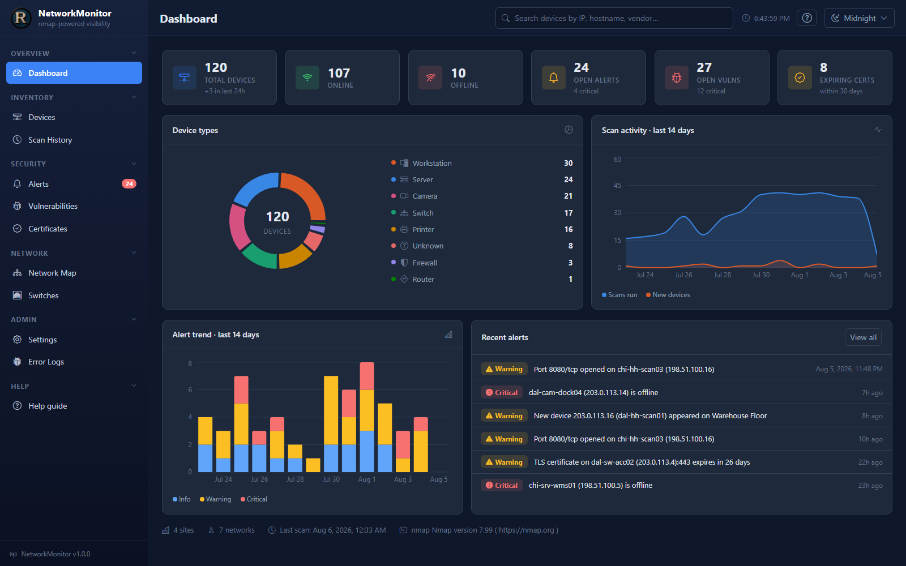
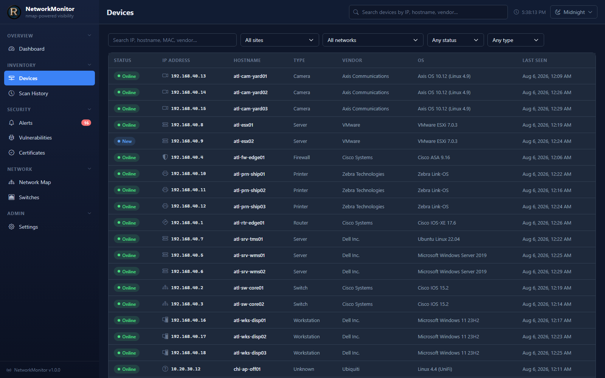
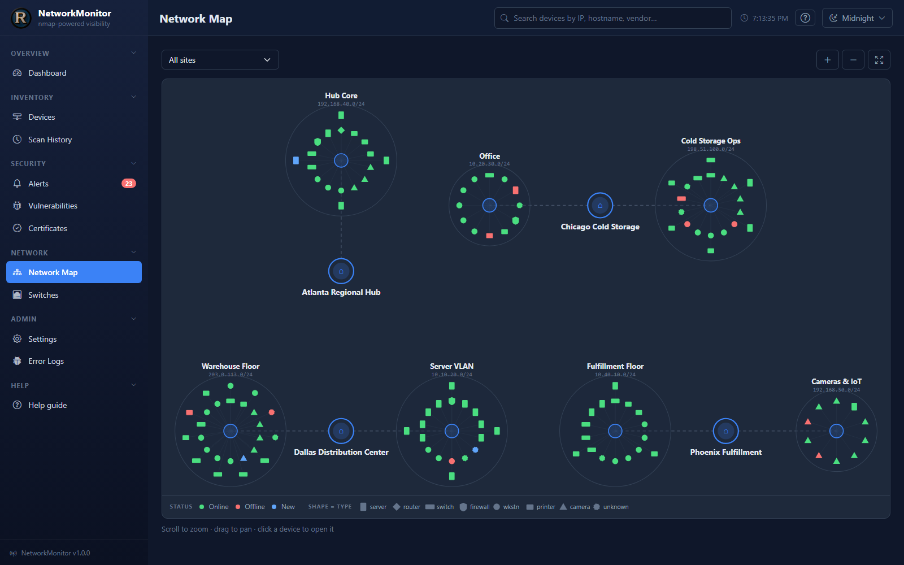
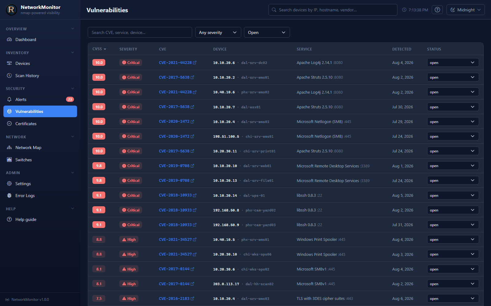

# NetworkMonitor

Nmap-driven network discovery, inventory, and monitoring for multi-site business networks — a .NET 10 API + React 19 SPA that turns raw port scans into an asset inventory, a change feed, and a vulnerability triage queue.

[](LICENSE)



| | |
|---|---|
|  |  |
|  | |

This is a sanitized, scaled-down public showcase derived from a production system that monitors multi-site industrial and warehouse networks. It runs out of the box against a fictional demo estate ("Northwind Logistics" — four sites, ~120 devices, 14 days of history), and against your own network once [nmap](https://nmap.org) is installed.

## What it does

A raw nmap scan tells you what is on the network *right now*. That is rarely the question an ops team is actually asking. NetworkMonitor runs scans on a schedule, keeps state between them, and answers the questions that matter:

- **Shadow-device detection** — anything that appears on a monitored subnet for the first time raises a `new_device` alert with its MAC vendor, hostname, and open ports. Unauthorized access points, forgotten test boxes, and personal devices surface within one scan interval instead of during the next audit.
- **Change control evidence** — every device keeps a port/service inventory; a service that starts or stops listening raises an alert. "Who opened RDP on the warehouse server?" becomes a timestamped record instead of an argument.
- **Vulnerability triage** — service versions found by scans are matched against CVEs and ranked by CVSS score, with a workflow status (`open` / `remediated` / `accepted_risk`) so the list shrinks instead of scrolling forever. TLS certificates are tracked too, so nothing expires unnoticed.
- **Uptime evidence** — per-device snapshots are recorded on every scan (status, open port count, response time), so you can show exactly when a device was reachable and when it wasn't.
- **Switch capacity** — switches and routers are polled over SNMP for per-interface throughput, errors, and utilization, so link saturation is a chart, not a guess.

## Features by page

| Page | What it gives you | Backing API |
|---|---|---|
| **Dashboard** | Fleet summary (online/offline/new devices, open alerts, vulnerabilities, expiring certs), device-type breakdown, 14-day scan-activity and alert-trend charts | `/api/dashboard/*` |
| **Devices** | Searchable, filterable, paged inventory across all sites; per-device detail with ports, alerts, CVEs, certificates, and scan history; operator fields (hardware, location, assigned-to, notes, flag, exclude) | `/api/devices` |
| **Network map** | Site → network → device topology view; sites carry coordinates for a facility map | `/api/devices/topology`, `/api/sites` |
| **Scans** | Scan history with per-run results and the exact nmap command that ran; on-demand scans against any network with any profile; the five built-in profile definitions | `/api/scans` |
| **Alerts** | Newest-first alert feed (new device, offline/online, port opened/closed, cert expiring), filterable by severity/type/site, acknowledge one or all | `/api/alerts` |
| **Vulnerabilities** | CVE list ranked by CVSS, filtered by severity/status/site, with per-finding remediation status | `/api/vulnerabilities` |
| **Certificates** | TLS certificates observed on open ports, with days-until-expiry | `/api/certificates` |
| **SNMP** | Per-switch interface tables and utilization time series | `/api/snmp/*` |
| **Sites & networks** | CRUD for sites and CIDR-defined networks; per-network scan cadence and per-profile nmap arguments | `/api/sites`, `/api/networks` |
| **Settings** | Key/value app settings plus system info (version, nmap availability, DB provider, demo mode) | `/api/settings` |
| **Error logs** | Failures from both tiers in one table — server exceptions, any `ILogger` call at Warning or above, and browser errors posted back by the client — with severity filters, full stack traces, correlation ids linking a browser report to the request that caused it, and a retention purge | `/api/logs` |
| **Help guide** | In-app documentation: searchable, deep-linkable sections covering every page, how change detection works, and the safety rules | — |
| **Guided tour** | An 11-step spotlight walkthrough that plays once on first run and can be replayed from the help guide or the top bar | — |

The full endpoint list is in [docs/API.md](docs/API.md).

## Quick start

Requires the [.NET 10 SDK](https://dotnet.microsoft.com/download) and [Node 20+](https://nodejs.org). No database server, no configuration:

```bash
git clone https://github.com/example/network-monitor.git && cd network-monitor
npm install --prefix networkmonitor.client
dotnet run --project NetworkMonitor.Server
```

The SPA proxy starts the Vite dev server automatically — open **https://localhost:5173**. On first run a SQLite database file is created and seeded with the Northwind Logistics demo estate: four sites (Dallas, Chicago, Atlanta, Phoenix), ~120 devices, and 14 days of scan history, alerts, CVEs, TLS certificates, and SNMP interface stats. All demo addresses are RFC 5737 documentation ranges or RFC 1918 private space.

**nmap is optional.** Without it, the app runs fully on the demo data and shows an "nmap not detected" banner; on-demand scans return 503. Install nmap and real scans of your own networks work from the Scans page. See [INSTALL.md](INSTALL.md) for per-OS instructions, Docker, and PostgreSQL.

Or, with Docker (image includes nmap):

```bash
docker compose up --build
```

then open http://localhost:8080.

## How the scanning works

Every network gets five scan profiles, each an nmap argument set with its own interval:

| Profile | Arguments (default) | Interval | Enabled | Purpose |
|---|---|---|---|---|
| `quick` | `-sn -PE -PP -PS22,80,443,3389,445 -PA80,445 -T4` | 5 min | yes | Host discovery only — cheap enough to run constantly |
| `deep` | `-sT -sV -T3 -PE -PP -PS22,80,443,3389,445 -PA80,445 --host-timeout 10m --max-retries 2 --top-ports 50` | 1 hour | yes | Service and version detection on the top 50 ports |
| `security` | `-sT -sV --script "(vuln or ssl-cert or ssl-enum-ciphers) and not (auth or brute or dos)" -T3 --top-ports 100 --host-timeout 4m` | weekly | no | NSE vulnerability + TLS scripts; heavier and noisier |
| `full_port` | `-sT -sV -p- -T3` | weekly | no | Every TCP port; slow, run deliberately |
| `udp` | `-sU -sV --top-ports 100 -T3 --host-timeout 5m --version-intensity 2` | weekly | no | UDP services; requires raw-socket privileges |

A background scheduler checks every 60 seconds for due profiles and runs them **one at a time** — nmap will happily saturate a link, and a monitoring tool that degrades the network it watches is worse than no monitoring at all.

The scheduler ships **disabled** (`Scanning:SchedulerEnabled: false`). A freshly cloned demo should never start scanning a network on its own; enable it once you have pointed it at networks you are authorized to scan. On-demand scans from the Scans page work regardless.

The interesting engineering is in the details that bite every nmap integration:

- **Discovery-probe injection.** Nmap's host discovery is all-or-nothing: specifying *any* `-P*` flag replaces the entire default probe set, so a profile that says just `-sV` silently loses TCP discovery and the deep scan reports a fraction of the hosts the quick scan found. When a profile expresses no discovery opinion, the executor injects the full default set (`-PE -PP -PS443 -PA80`) so every profile sees the same hosts.
- **`--open` stripping.** `--open` omits hosts with no open ports from the XML entirely — even when they answered discovery. Downstream that reads as "host disappeared" and produces false offline alerts, so the flag is always stripped from profile arguments.
- **Change detection, not snapshots.** After each scan the orchestrator diffs the parsed results against stored state: first sightings become `new` devices (with an alert), known devices are refreshed, a device that returns from offline gets an `info` alert, and port-level drift (a service that appeared or vanished) is alerted individually. A quick ping sweep returns no port data, so it never closes ports or downgrades a device classification made by a deep scan.
- **Missed-scan debounce.** A single unanswered scan is noise — a laptop slept, a packet dropped. A device only flips to `offline` (and alerts at `critical`) after a configurable number of *consecutive* missed scans (default 3). One dropped probe should never page anyone.
- **Reproducibility.** The exact command line and the raw nmap XML are stored on every scan record, and the XML parser runs with DTD processing disabled so a hostile or malformed XML file cannot become an XXE hole.

Devices are classified (`router`, `switch`, `firewall`, `printer`, `server`, `workstation`, `camera`) from the strongest available signal — open management ports first, then OS fingerprint, MAC vendor, and hostname conventions.

## Tech stack

| Layer | Technology |
|---|---|
| API | ASP.NET Core (.NET 10), controllers + Swagger/OpenAPI |
| ORM | EF Core 10 — SQLite by default, PostgreSQL via config |
| Scanning | nmap (external process), XML output parsed XXE-safe |
| SNMP | SharpSnmpLib (v2c interface polling) |
| Background work | `BackgroundService` scheduler (in-process in this build) |
| Front end | React 19, TypeScript, Vite |
| Tests | xUnit (server), Vitest (client), Playwright (E2E) |
| Packaging | Multi-stage Dockerfile, docker-compose |

## Project layout

```
network-monitor/
├── NetworkMonitor.sln
├── NetworkMonitor.Server/           # ASP.NET Core API + hosts the built SPA
│   ├── Configuration/               #   Options classes (Scanning, Alerts, Demo)
│   ├── Context/                     #   EF Core DbContext
│   ├── Controllers/                 #   API endpoints (see docs/API.md)
│   ├── Helpers/                     #   CidrUtil — target validation
│   ├── Models/                      #   The 13 entities
│   ├── Services/                    #   Nmap executor, XML parser, classifier,
│   │                                #   scan orchestrator, scheduler, demo seeder
│   └── Program.cs
├── networkmonitor.client/           # React 19 + Vite + TypeScript SPA
├── NetworkMonitor.Tests/            # xUnit server tests
├── docs/
│   ├── API.md                       # Endpoint reference
│   └── ARCHITECTURE.md              # Design + scaling to distributed agents
├── Dockerfile
└── docker-compose.yml
```

## Security model

> **This build has no authentication. It is a demo.** Every endpoint is open to anyone who can reach the port. Run it on localhost or an isolated lab network only — do not expose it to an untrusted network, and especially not to the internet. An unauthenticated tool that can launch port scans and edit inventory is a liability, not a feature.

The production system this showcase derives from sat behind SSO with role-based access (viewer / operator / admin). The seam where that plugs in is deliberately clean: ASP.NET Core's standard authentication middleware in `Program.cs` (`AddAuthentication` + `UseAuthentication`/`UseAuthorization`) plus authorization policies or a global action filter on the controllers — for example, a policy that restricts mutating endpoints (`POST /api/scans/run`, site/network CRUD, device edits) to an operator role while leaving read endpoints to viewers. Nothing in the request pipeline assumes anonymity; adding an OIDC provider and `[Authorize]` attributes requires no restructuring.

Scanning itself is guarded in ways that matter even in a demo:

- **CIDR validation before the command line.** Every scan target (and every exclusion) must match a strict IPv4/prefix shape and parse as a real address before it is placed on the nmap command line — anything else is rejected outright rather than escaped, which eliminates argument-injection by construction.
- **Target size cap.** Targets larger than `Scanning:MaxTargetAddresses` (default 65,536 addresses) are refused. A mistyped `/8` is 16.7M hosts and will take days; the guard is cheaper than the incident.
- **`--exclude` support.** Devices marked *excluded* are passed to nmap's `--exclude` — they are never probed, not just filtered from results afterwards.
- **Only scan networks you are authorized to scan.** Port scanning networks you do not own or administer may violate law or policy. The demo dataset exists precisely so you can evaluate the app without scanning anything.

## Testing

```bash
dotnet test                                      # server unit + integration tests (xUnit)
npm test --prefix networkmonitor.client          # client unit tests (Vitest)
npx playwright test                              # E2E, from networkmonitor.client, app running
```

## Documentation

- [INSTALL.md](INSTALL.md) — prerequisites, Visual Studio / CLI / Docker, PostgreSQL, full configuration reference, troubleshooting, production notes
- [docs/ARCHITECTURE.md](docs/ARCHITECTURE.md) — component design, data model, and how in-process scanning scales out to distributed per-site agents
- [docs/API.md](docs/API.md) — endpoint reference (also browsable live at `/swagger` in Development)

## License

[MIT](LICENSE) — Copyright (c) 2026 Ryan Gross
