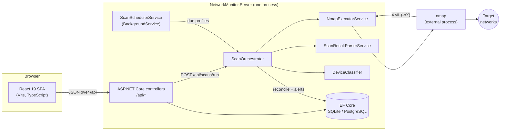
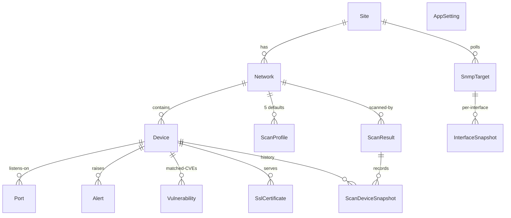
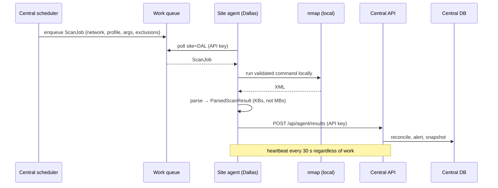

# Architecture

How NetworkMonitor is put together, why the scan pipeline looks the way it does, and (the part this repo is really showcasing) how the in-process design scales out to distributed per-site scan agents.

## Contents

- [System overview](#system-overview)
- [The scan pipeline](#the-scan-pipeline)
- [Data model](#data-model)
- [Scheduling](#scheduling)
- [Scaling out: distributed per-site agents](#scaling-out-distributed-per-site-agents)

## System overview

Single process, three layers:



Key components (all under `NetworkMonitor.Server/`):

| Component | File | Responsibility |
|---|---|---|
| `NmapExecutorService` | `Services/ScanServices.cs` | Runs nmap as an external process; validates targets (`CidrUtil`), injects default discovery probes, strips `--open`, applies `--exclude`, returns XML path + the exact command line |
| `ScanResultParserService` | `Services/ScanServices.cs` | Nmap XML → DTOs. DTD processing disabled (nmap output carries a DOCTYPE; honoring it would be an XXE hole) |
| `DeviceClassifier` | `Services/ScanServices.cs` | Best-effort device typing from open ports, OS guess, MAC vendor, hostname; most specific signal wins |
| `ScanOrchestrator` | `Services/ScanOrchestrator.cs` | End-to-end scan: execute → parse → reconcile against stored state → raise alerts → persist snapshots |
| `ScanSchedulerService` | `Services/ScanOrchestrator.cs` | Background loop; every tick runs profiles whose interval has elapsed, one at a time |
| `DemoDataSeeder` | `Services/` | Seeds the fictional Northwind Logistics estate on first run when the DB is empty |
| `CidrUtil` | `Helpers/CidrUtil.cs` | Strict IPv4/CIDR shape validation before anything reaches a command line; address counting for the target-size cap |
| Controllers | `Controllers/` | The REST surface documented in [API.md](API.md) |

The React SPA is a separate Visual Studio JavaScript project (`networkmonitor.client.esproj`). In development the ASP.NET SPA proxy launches Vite and proxies; in production (and Docker) the built `dist/` is served from the server's `wwwroot` with a SPA fallback route, so there is exactly one deployable.

## The scan pipeline

`ScanOrchestrator.RunScanAsync(networkId, profileType)` is the whole story:

1. **Resolve the profile.** Per-network `ScanProfile` rows override; `ScanProfileDefaults` (the five built-ins: `quick`, `deep`, `security`, `full_port`, `udp`) are the fallback, so the create path and the backfill path cannot drift apart.
2. **Collect exclusions.** Devices flagged `IsExcluded` are gathered *before* the scan and passed to nmap's `--exclude`: skipped at the scanner level, never merely filtered from results.
3. **Execute.** `NmapExecutorService` validates the CIDR, fixes up the argument string (probe injection and `--open` stripping; see README "How the scanning works"), writes XML to a GUID-named temp file so parallel runs can't collide, and drains stdout/stderr concurrently (sequential reads deadlock on chatty scans).
4. **Persist the evidence.** The exact command line and the raw XML are stored on the `ScanResult` row. Failed scans are recorded with their failure reason rather than thrown away.
5. **Reconcile.** The parsed hosts are diffed against the network's stored devices:
   - Unknown IP → new `Device` (status `new`), classified, `new_device` alert.
   - Known IP → identity refreshed (nulls never overwrite known values), `MissedScans` reset, status `online`; a return from `offline` raises a `device_online` alert. Re-classification only happens when the scan actually learned something (open ports or an OS guess); a ping sweep must not downgrade a device typed by a deep scan.
   - Ports diffed per device: a newly listening service raises `port_opened` (that drift is exactly what change control wants to see); a vanished one raises `port_closed`. Port removal only happens when the scan probed ports at all.
   - Covered-but-silent devices increment `MissedScans`; at the configured threshold (default 3 consecutive) the device flips `offline` with a `critical` alert. The debounce exists because a single dropped probe should never page anyone.
   - Every device covered by the scan gets a `ScanDeviceSnapshot` (status, open port count, latency); this is what makes per-device history queryable.

The design principle: **a raw scan tells you what is there now; reconciliation tells you what is different**, and "different" is the only part a human needs to read.

## Data model

Thirteen entities (`Models/Entities.cs`), owned top-down:



Notes worth calling out:

- `Device` is unique on `(NetworkId, IpAddress)`; a repeat scan updates rather than duplicates. `LastSeen` (last time it answered) is distinct from `LastScannedAt` (last time a scan covered it); staleness checks key on the latter.
- `ScanResult.RawXml` keeps the unmodified nmap output for forensics but is `[JsonIgnore]`d: far too large for list responses.
- `SnmpTarget.Community` is `[JsonIgnore]`d so the v2c community string never leaves the server in API responses.
- `AppSetting` is a plain key/value table backing the Settings page.

Storage is EF Core with `EnsureCreated()` at startup, deliberately provider-agnostic (the same model builds a fresh SQLite file or a Postgres schema with no per-provider migration history). The documented trade-off: switch to real migrations before a production deployment (see INSTALL.md).

## Scheduling

`ScanSchedulerService` is a `BackgroundService` that ticks every `Scanning:SchedulerTickSeconds` (default 60 s), loads enabled profiles on enabled networks, and runs any profile whose `LastRunAt + IntervalSeconds` has elapsed: **sequentially, one scan at a time**. That is a deliberate throttle, not a limitation to apologize for: nmap will happily saturate a link, and a monitoring tool that degrades the network it watches is worse than no monitoring at all. A failed cycle is logged and never kills the loop.

This in-process model is the right shape for the demo and for any single-site deployment. It stops being the right shape the moment there is more than one site, which brings us to the interesting part.

## Scaling out: distributed per-site agents

### Why in-process scanning cannot span sites

In this build, the process that serves the API is also the process that runs nmap. Three things break as an estate grows:

1. **Reachability.** One host cannot see every VLAN. Scans from outside a subnet cannot ARP, so MAC addresses and vendor identification are lost; firewalls between sites drop or mangle probes; and segmented networks (OT/industrial VLANs especially) are often *deliberately* unreachable from the data center. The scanner has to sit inside the network it scans.
2. **WAN load.** A `deep` profile against a /24 is thousands of probe packets per host. Hauling that across a site-to-site WAN link (repeatedly, on a schedule, for every remote subnet) is scan traffic on exactly the links that can least afford it. Scan traffic should stay local to the site; only *results* should cross the WAN, and a parsed scan result is a few kilobytes where the probes were megabytes.
3. **Throughput.** One sequential scan queue serving N sites means every site's cadence degrades as sites are added. A 20-minute `full_port` run at one site should not delay host discovery at another.

### The distributed shape

The pipeline was built with a clean seam in exactly the right place: everything **up to and including XML parsing** is site-local work, and everything **from reconciliation onward** is central state. Split there:

```
CURRENT (this build): one process does everything
┌─────────────────────────────────────────────────────────────┐
│ NetworkMonitor.Server                                       │
│                                                             │
│  API ⇄ DB ⇄ ScanOrchestrator ⇄ NmapExecutor ⇄ nmap ─────┼──▶ local networks
│              ▲                                              │
│              └── ScanSchedulerService (in-process timer)    │
└─────────────────────────────────────────────────────────────┘

SCALED OUT: central brain, per-site muscle
                       ┌────────────────────────────────────┐
                       │  Central NetworkMonitor.Server     │
                       │  API ⇄ DB ⇄ Reconciler + Alerts    │
                       │  Scheduler → work queue (per site) │
                       └───────┬──────────────┬─────────────┘
             results up /      │              │       heartbeats +
             work down (HTTPS) │              │       API-key auth
                ┌──────────────┘              └──────────────┐
                ▼                                            ▼
   ┌────────────────────────┐                  ┌────────────────────────┐
   │ Site agent: Dallas     │                  │ Site agent: Chicago    │
   │ nmap + parser only     │                  │ nmap + parser only     │
   │ scans stay on-site     │                  │ scans stay on-site     │
   └───────────┬────────────┘                  └───────────┬────────────┘
               ▼                                           ▼
        203.0.113.0/24 …                            198.51.100.0/24 …
```



### The components

**1. A lightweight agent service per site.** A small headless .NET worker (or container) deployed on one host inside each site, holding only the site-local pieces this codebase already isolates: `NmapExecutorService`, `ScanResultParserService`, and `CidrUtil`. It has no database, no UI, and no inbound ports; it makes outbound HTTPS calls only, which matters enormously for firewall policy at remote sites (nothing to open inbound; the agent dials home). Because the executor/parser pair is already interface-shaped (`INmapExecutorService`, `IScanResultParserService`) and has no EF dependency, the agent is a repackaging, not a rewrite.

**2. A work queue.** The central scheduler stops calling `ScanOrchestrator` directly and instead enqueues scan jobs (`{jobId, siteKey, networkId, cidr, profileType, nmapArgs, exclusions, notBefore}`) onto a per-site queue. Two workable transports:

   - *HTTPS long-poll* (`GET /api/agent/jobs?wait=30s`): simplest, no extra infrastructure, works through any egress firewall. Right answer up to dozens of sites.
   - *Message bus* (RabbitMQ/NATS, one queue per site): push semantics, delivery acknowledgment, and natural fan-out when a site runs more than one agent. Right answer when job volume or latency starts to matter.

   Either way the queue carries **fully resolved arguments**: the agent never composes nmap flags itself, so target validation and the argument fix-ups (probe injection, `--open` stripping, the target-size cap) stay centralized where they can be audited and updated once.

**3. Agent identity: API keys + heartbeats.** Each agent enrolls with a per-agent API key (issued when the agent is registered against a site, sent as a bearer header, revocable individually). Every claim, result push, and heartbeat is authenticated with it; an agent can only fetch jobs and post results for *its* site, so a compromised host at one site cannot inject inventory into another. Agents heartbeat on a fixed interval (~30 s) with version, nmap version, and queue depth; the central server tracks `lastHeartbeatAt` per agent and raises an alert when one goes quiet; the monitoring system monitors its own reach. A site with a dead agent shows as "stale", which is honest, instead of silently flipping every device offline, which would be a lie. (This is the missed-scan debounce idea applied one level up.)

**4. Result push + central reconciliation.** The agent posts the parsed result (`hostsUp/hostsDown`, host/port/script details, the exact command, optionally the raw XML compressed for forensics) to `POST /api/agent/results`. Reconciliation, classification, alerting, snapshots, CVE matching (everything that needs global state) stays exactly where it is, in the central `ScanOrchestrator`/reconcile path against the one authoritative database. Result posts are idempotent on `jobId`, so an agent that crashes after posting but before acknowledging can safely retry.

**5. Delivery semantics.** Jobs carry a lease: an agent claims a job, and if no result or heartbeat-extension arrives before the lease expires, the job returns to the queue. Combined with idempotent result posts, this gives at-least-once execution with exactly-once *recording*: the worst case is a redundant scan, never lost or duplicated inventory.

### Trade-offs, honestly

| | In-process (this build) | Distributed agents |
|---|---|---|
| Moving parts | One process, one DB | Central server + N agents + queue + key management |
| Reach | Subnets routable (and ARP-able) from one host | Every site, from inside; MAC/vendor data preserved |
| WAN impact | Full probe traffic crosses the WAN for remote subnets | Only parsed results (KBs) cross; probes stay local |
| Throughput | One global sequential scan queue | Parallel across sites; still serialized *within* a site to protect local links |
| Failure modes | Process dies → everything stops (obvious) | Partial failure: one site stale while others run (needs surfacing: heartbeat alerts) |
| Deploy/upgrade | One deployable | Agent fleet versioning; the heartbeat's version field exists to manage the rollout |
| Security surface | One box to protect | Per-agent credentials to issue/rotate/revoke; but agents are outbound-only and least-privilege per site |
| Debugging | One log | Correlate by jobId across agent and server logs |

The rule of thumb: one site, or a handful of subnets all routable from one well-placed host: stay in-process; the complexity buys nothing. More than one physical site, any OT/segmented network, or WAN links you care about: the agent split pays for itself almost immediately, and the codebase's seams (interface-isolated executor/parser, centralized argument policy, reconciliation already independent of *where* the XML came from) are cut so that the move is incremental rather than a rewrite.
